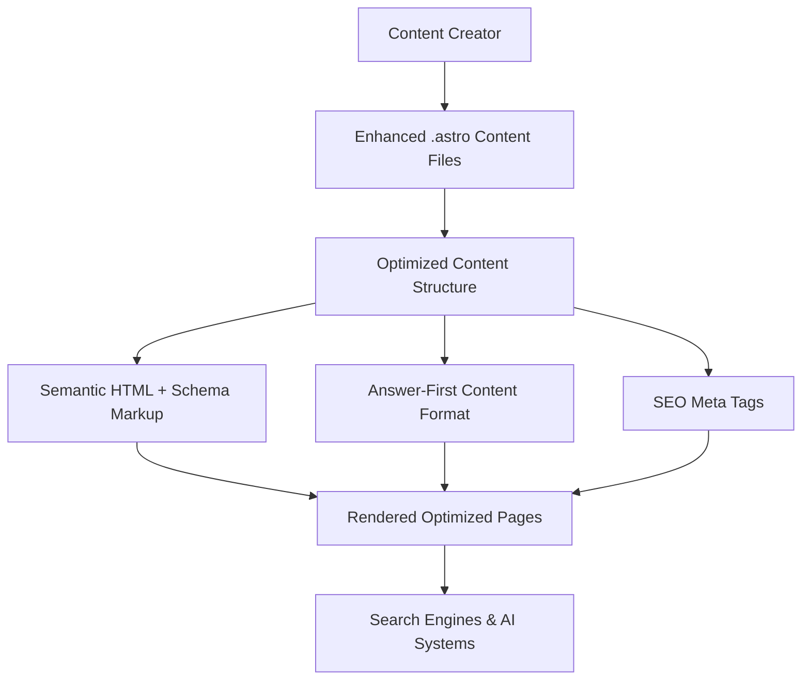

# Design Document

## Overview

This design outlines a simple enhancement to the existing MMC Astro content system to make it SEO and GEO optimized. The solution maintains the current .astro file format while adding essential optimization elements that ensure content is discoverable and citable by both traditional search engines and AI-powered systems.

The approach focuses on three key areas: enhanced content structure with semantic HTML, strategic schema markup for entity recognition, and GEO-optimized content formatting for AI comprehension and citation.

## Architecture

### Simplified System Architecture



### Content Enhancement Approach

1. **Enhanced contentData Structure**: Add SEO/GEO fields to existing structure
2. **Template Optimization**: Update .astro templates with semantic HTML and schema markup
3. **Content Formatting Guidelines**: Structure content for both human readers and AI systems

## Components and Interfaces

### 1. Enhanced ContentData Structure

The existing contentData object will be extended with essential SEO/GEO fields:

```typescript
interface EnhancedContentData {
  // Existing fields
  title: string;
  summary: string;
  author: string;
  pubDate: Date;
  tags: string[];
  type: string;
  featured: boolean;
  
  // New SEO fields
  metaDescription?: string;
  focusKeywords: string[];
  
  // New GEO fields
  faqSections?: FAQSection[];
  howToSteps?: HowToStep[];
  
  // Schema type
  schemaType: 'Article' | 'HowTo' | 'FAQPage';
  
  // E-E-A-T signals
  authorCredentials?: string[];
  sources?: string[];
}

interface FAQSection {
  question: string;
  answer: string;
}

interface HowToStep {
  name: string;
  text: string;
}
```

### 2. Template Structure Enhancements

#### Base Layout with SEO/GEO Optimization
The main layout template will include:
- Comprehensive meta tags for SEO
- JSON-LD schema markup based on content type
- Semantic HTML structure for AI comprehension
- Open Graph and Twitter Card meta tags

#### Content Structure Components
- **FAQ Section Component**: Structured Q&A format with proper schema
- **How-To Section Component**: Step-by-step instructions with HowTo schema
- **Answer-First Content Blocks**: Direct answers followed by detailed explanations

### 3. Template Examples

#### Enhanced Layout Template
```astro
---
// Enhanced Layout.astro with SEO/GEO optimization
interface Props {
  contentData: EnhancedContentData;
}

const { contentData } = Astro.props;

// Generate schema markup based on content type
const generateSchema = (data: EnhancedContentData) => {
  const baseSchema = {
    "@context": "https://schema.org",
    "@type": data.schemaType,
    "headline": data.title,
    "description": data.metaDescription || data.summary,
    "author": {
      "@type": "Person",
      "name": data.author
    },
    "datePublished": data.pubDate.toISOString(),
    "publisher": {
      "@type": "Organization",
      "name": "MMC Financial"
    }
  };

  // Add FAQ schema if present
  if (data.faqSections && data.faqSections.length > 0) {
    return {
      ...baseSchema,
      "@type": "FAQPage",
      "mainEntity": data.faqSections.map(faq => ({
        "@type": "Question",
        "name": faq.question,
        "acceptedAnswer": {
          "@type": "Answer",
          "text": faq.answer
        }
      }))
    };
  }

  // Add HowTo schema if present
  if (data.howToSteps && data.howToSteps.length > 0) {
    return {
      ...baseSchema,
      "@type": "HowTo",
      "step": data.howToSteps.map((step, index) => ({
        "@type": "HowToStep",
        "position": index + 1,
        "name": step.name,
        "text": step.text
      }))
    };
  }

  return baseSchema;
};

const schema = generateSchema(contentData);
---

<html lang="en">
<head>
  <!-- SEO Meta Tags -->
  <title>{contentData.title} | MMC Financial</title>
  <meta name="description" content={contentData.metaDescription || contentData.summary} />
  <meta name="keywords" content={contentData.focusKeywords?.join(', ') || contentData.tags.join(', ')} />
  
  <!-- Open Graph -->
  <meta property="og:title" content={contentData.title} />
  <meta property="og:description" content={contentData.metaDescription || contentData.summary} />
  <meta property="og:type" content="article" />
  
  <!-- Schema Markup -->
  <script type="application/ld+json" set:html={JSON.stringify(schema)} />
</head>
<body>
  <slot />
</body>
</html>
```

#### Example Usage in Content Files
```astro
---
// financial-planning.astro
import Layout from '../../layouts/Layout.astro';
import FAQSection from '../../components/ui/FAQSection.astro';
import HowToSection from '../../components/ui/HowToSection.astro';

const contentData = {
  title: "Financial Planning Guide",
  // ... other fields
  faqSections: [
    {
      question: "What is financial planning?",
      answer: "Financial planning is the process of..."
    }
  ],
  howToSteps: [
    {
      name: "Assess your current financial situation",
      text: "Start by calculating your net worth..."
    }
  ]
};
---

<Layout contentData={contentData}>
  <main>
    <h1>{contentData.title}</h1>
    
    <!-- Your regular content here -->
    <p>Financial planning content...</p>
    
    <!-- Use the reusable components -->
    {contentData.faqSections && (
      <FAQSection faqs={contentData.faqSections} />
    )}
    
    {contentData.howToSteps && (
      <HowToSection steps={contentData.howToSteps} />
    )}
  </main>
</Layout>
```

## Data Models

### Content File Structure
The system maintains the existing file-based approach with enhanced contentData:

```
src/
├── components/
│   ├── ui/
│   │   ├── FAQSection.astro          # Reusable FAQ component (create once)
│   │   ├── HowToSection.astro        # Reusable How-To component (create once)
│   │   └── AnswerBlock.astro         # Answer-first content blocks (create once)
└── pages/content/
    ├── [content-file].astro          # Enhanced with new contentData structure
    ├── financial-planning.astro      # Uses the reusable components
    ├── budget-optimization.astro     # Uses the reusable components
    └── cash-flow-management.astro    # Uses the reusable components
```

**How it works:**
1. Create the 3 reusable components once in `src/components/ui/`
2. Import and use them in any content file that needs FAQ, How-To, or Answer-First sections
3. Pass the relevant data from your contentData to these components

### Content Organization Guidelines
- Use semantic HTML structure (proper heading hierarchy)
- Include answer-first content blocks for key questions
- Add FAQ sections for common user queries
- Structure how-to content with clear steps
- Include proper schema markup for content type

## Error Handling

### Content Validation
- Ensure required contentData fields are present
- Validate schema markup syntax
- Check for proper heading hierarchy
- Verify meta tag completeness

### Graceful Degradation
- Missing optional fields don't break functionality
- Schema markup failures fall back to basic HTML
- SEO enhancements are additive, not required for basic functionality

## Testing Strategy

### Validation Testing
- **Schema Markup**: Use Google's Rich Results Test to validate JSON-LD
- **SEO Compliance**: Check meta tags and semantic HTML structure
- **Mobile Responsiveness**: Ensure content works on all devices
- **Accessibility**: Verify content meets basic accessibility standards

### Content Quality Checks
- **Heading Hierarchy**: Ensure proper H1-H6 structure
- **Answer-First Format**: Verify direct answers are provided for key questions
- **FAQ Structure**: Check that Q&A sections are properly formatted
- **Internal Linking**: Ensure related content is properly linked

### Performance Validation
- **Page Load Speed**: Ensure optimizations don't slow down pages
- **Build Time**: Monitor impact on Astro build process
- **Schema Validation**: Verify all generated schema is syntactically correct